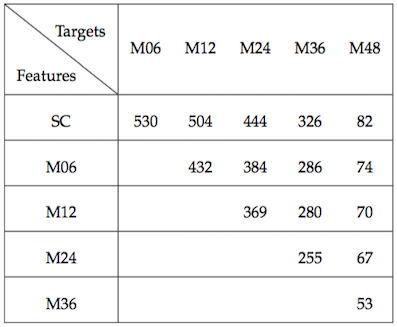
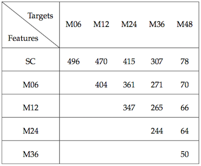

# Two-dimensional Proximal Constraints with Group Lasso for Disease Progression Prediction

## Methodology
In this paper, we mainly contribute in extending multitask learning models with one-dimensional constraint [Zhou 2011, Zhou 2012, Zhou 2013] into model with two-dimensional ones.
- Extension From 1D-TGL to 2D-TGL and 2D-TGL+
- Extension From 1D-cFSGL to 2D-cFSGL and 2D-cFSGL+


## Dataset
In this experiment, we use dataset provided by Alzheimer’s Disease Neuroimaging Initiative (ADNI), whose information can be found in their [website](http://adni.loni.usc.edu/).


### How To Obtain Dataset?
Since the dataset is preserved for request-only. unfortunately, we cannot provide the dataset publicly. To request for the dataset, please refer to this [link](http://adni.loni.usc.edu/data-samples/access-data/).


### What Is Included In The Dataset?
To fully reproduce our experiment results, a list of dataset is required. Files provide two kinds of features as follows.
1. MRI features
    - UCSFFSL_02_01_16.csv
2. META features 
    - ADASSCORES.csv
    - CDR.csv
    - FAQ.csv
    - GDSCALE.csv
    - LABDATA.csv
    - MODHACH
    - NEUROBAT.csv
    - PTDEMOG.csv
    - MMSE.csv

A detailed information for META features are shown as below.


### How To Preprocess Dataset?
Once all the dataset is downloaded, please make sure to put all those downloaded files under the folder [dat/Origin](dat/Origin/) and create folder [dat/TGL_sgl/Longitudinal](dat/TGL_sgl/Longitudinal/) and [dat/TGL_mtl/Longitudinal](dat/TGL_mtl/Longitudinal/).

After that, please execute both [parser_sgl_LS.R](src/parser_sgl_LS.R) and [parser_mtl_LS.R](src/parser_mtl_LS.R) files, which will generate a processed data combined two different feature sets (MRI, MRI+META) and two different objective scores (MMSE, ADAS-Cog: TOTAL11).

At the end, please execute both [mergeTP_sgl.py](src/mergeTP_sgl.py) and [mergeTP_mtl.py](src/mergeTP_mtl.py) files, which will generate all needed tasks for later model learning.

The number of instances for MRI and MRI+META are shown as two figures below.

1. Number of instances with MRI feature

2. Number of instances with MRI+META feature



## Experiments and Results
All the experiment is conducted under five-fold cross-validation and are repeated with five different seeds; furthermore, in each fold, experiment results are reweighed by the sample size in each time point.

### Which Algorithms Are Implemented?

#### MATLAB Files
For one-dimensional algorithms, we implemented three algorithms as following.
1. [Least_Lasso_sgl.m](src/Least_Lasso_sgl.m)
2. [Least_TGL_sgl.m](src/Least_TGL_sgl.m)
3. [Least_CFGLasso_sgl.m](src/Least_CFGLasso_sgl.m)

For two-dimensional algorithms, we implemented five algorithms as follows.
1. [Least_Lasso_mtl.m](src/Least_Lasso_mtl.m)
2. [Least_TGL_mtl_g.m](src/Least_TGL_mtl_g.m)
3. [Least_TGL_mtl_n.m](src/Least_TGL_mtl_n.m)
4. [Least_CFGLasso_mtl_g_fl.m](src/Least_CFGLasso_mtl_g_fl.m)
5. [Least_CFGLasso_mtl_n.m](src/Least_CFGLasso_mtl_n.m)

To cooperate with *MALSAR* package, we edit the parameter parsing file [sll_opts.m](src/sll_opts.m) in it and submit this edited file within this repository.

#### C++ File
In order to approximate the optimal of *2D-cFSGL+* using [Least_CFGLasso_mtl_g_fl.m](src/Least_CFGLasso_mtl_g_fl.m), we implement pathwise coordinate optimization algorithm [Friedman 2007], as [TDFusedLasso.cpp](src/TDFusedLasso.cpp) and [TDFusedLasso(gcc-old).cpp](src/TDFusedLasso%28gcc-old%29.cpp).

The pseudo code for the implementation can be found [here](img/pseudo_code.pdf).


### How To Run Experiments?

#### Path Setting
To reproduce our experiments, please refer to [run_Ridge_sgl.m](src/run_Ridge_sgl.m), [run_Least_sgl.m](src/run_Least_sgl.m) and [run_Least_mtl.m](src/run_Least_mtl.m). Since our implementation works closely to *MALSAR* package, one needs to manually replace the **{MALSAR_PATH}** with correct *MALSAR* local path.

#### Mex File Compiling
To run [Least_CFGLasso_mtl_g_fl.m](src/Least_CFGLasso_mtl_g_fl.m), one needs to compile [TDFusedLasso(gcc-old).cpp](src/TDFusedLasso%28gcc-old%29.cpp) with command as follows.
```
mex TDFusedLasso(gcc-old).cpp
```
It is noticeable that [TDFusedLasso.cpp](src/TDFusedLasso.cpp) utilizes newer C++ support, which might not be feasible for old mex compiler. Instead, [TDFusedLasso(gcc-old).cpp](src/TDFusedLasso%28gcc-old%29.cpp) is a much more reliable solution.

#### Experiment Switching
FOr now, one needs to manually comment and uncomment some blocks of codes to examine one specific algorithm. It is noticeable that [run_Ridge_sgl.m](src/run_Ridge_sgl.m) is used for Ridge algorothm, [run_Least_sgl.m](src/run_Least_sgl.m) is used for one-dimensional algorithms; while [run_Least_mtl.m](src/run_Least_mtl.m) is designed for two-dimensional algorithms.


### How To Explain Results?
From both examination tables listed in the appendix, one can tell that we fail to reject **Hypothesis I: straightforwardly applying 2D concept without adding the proposed constraints cannot bring significant improvement** but successivly reject **Hypothesis II: the 2D concept with the proposed constraints cannot bring significant improvement**.

In other words, from experient results, we show that simply considering more information, such as *2D-TGL* and *2D-cFSGL*, will not lead to great model improvement. However, adding additional proper constraints between weighing matrices in another direction, i.e. *2D-TGL+* and *2D-cFSGL+*, can significantly improve the model performance.


## Appendix: Experiment Results
1. Correlated Coefficient (CC) Evaluation Metric


2. Root Mean Squared Error (RMSE) Evaluation Metric


## Appendix: Repository Structure
```
Two-dimensional-Proximal-Constraints-with-Group-Lasso-for-Disease-Progression-Prediction
├── README.md
├── README.md.ipynb
├── dat
│   ├── Origin
│   ├── TGL_mtl
│   │   └── Longitudinal
│   └── TGL_sgl
│       └── Longitudinal
├── img
│   ├── META_feature_info.png
│   ├── MRI+META_num_instance.png
│   ├── MRI_num_instance.png
│   ├── pseudo_code.pdf
│   ├── result_coefficient.png
│   └── result_rmse.png
└── src
    ├── Least_CFGLasso_mtl_g_fl.m
    ├── Least_CFGLasso_mtl_n.m
    ├── Least_CFGLasso_sgl.m
    ├── Least_Lasso_mtl.m
    ├── Least_Lasso_sgl.m
    ├── Least_TGL_mtl_g.m
    ├── Least_TGL_mtl_n.m
    ├── Least_TGL_sgl.m
    ├── TDFusedLasso(gcc-old).cpp
    ├── TDFusedLasso.cpp
    ├── TDFusedLasso.mexmaci64
    ├── TDFusedLasso.o
    ├── mergeTP_mtl.py
    ├── mergeTP_sgl.py
    ├── parser_mtl_LS.R
    ├── parser_sgl_LS.R
    ├── run_Least_mtl.m
    ├── run_Least_sgl.m
    ├── run_Ridge_sgl.m
    └── sll_opts.m
    
8 directories, 28 files
```
